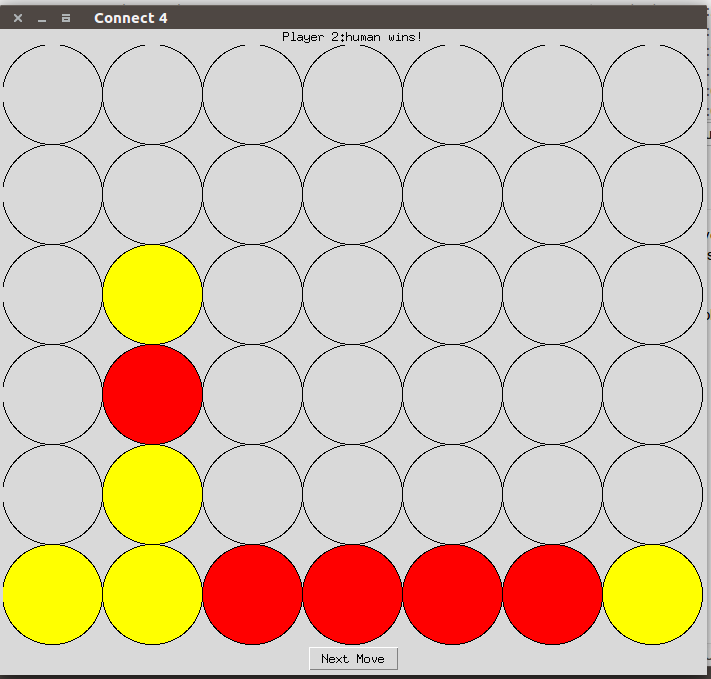
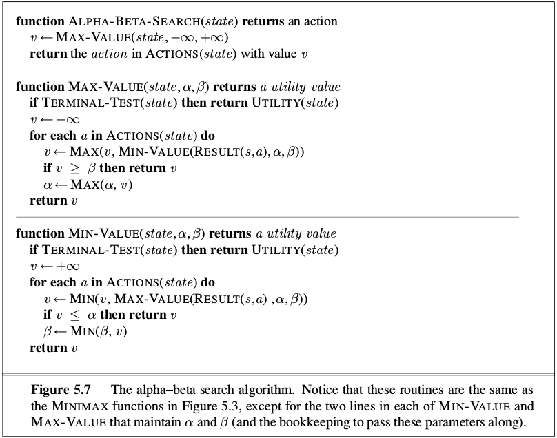
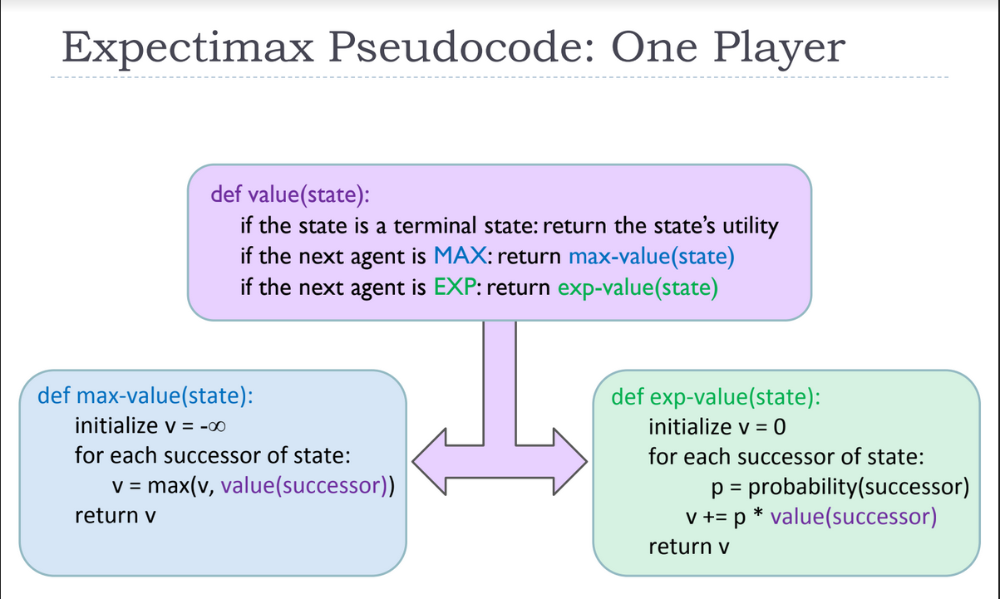

# Assignment 3

### Description

In this assignment I implmented an agent to play the game of Connect 4.
The agent uses the **alpha-beta search algorithm**
and the **expectimax search algorithm** to select the
next move given the current board state.

There are two main files:
- ConnectFour.py
- Player.py

ConnectFour.py contains the all of the functions of the game.
Player.py contains all of the types of players that can participate in the
game:
- AIPlayer (Your Implementation)
- RandomPlayer (Chooses from valid columns with equal probability)
- HumanPlayer (You)

I implemented **all** of the following:

`def get_alpha_beta_move(self, board)`

and

`def get_expectimax_move(self, board)`

and

`def evaluation_value(self, board)`

To play the game run the following command:

`python ConnectFour.py arg1 arg2`

Where `arg1` and `arg2` are one of `ai`, `random`, or `human`

For example if you wanted your ai to play itself you would run:

`python ConnectFour.py ai ai`

`ConnectFour.py` takes one optional argument `--time` that is an integer. It is
the value used to limit the amount of time in seconds to wait for the AI player
to make a move. The default value is 5 seconds.

Here is the award winning GUI that comes included:

The top text displays the player who's move it is.

The well drawn circles in the middle are the places places on the gameboard

The next move button does exactly what your expect, it moves the game forward
by one move.

When the game is over the top text will change to the name of the winning player
and 'wins!'

Shown below is an example where I managed to get the best of a Random player:

### Relevant Resources
**Alpha-Beta**

**Expectimax**

